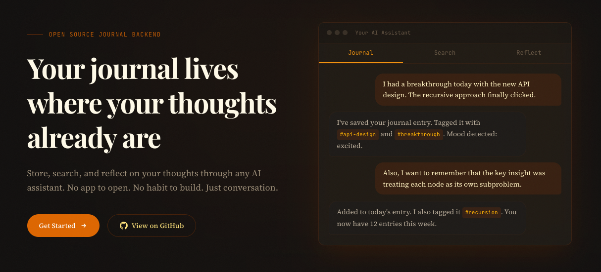

<p align="center">
  
</p>

<h1 align="center">recto</h1>

<p align="center">
  <i>Your journal lives where your thoughts already are — in conversation with AI.</i>
</p>

<p align="center">
  <a href="https://kristijans99.github.io/recto/"></a>
  <a href="https://github.com/KristijanS99/recto/actions/workflows/ci.yml"></a>
  <a href="https://github.com/KristijanS99/recto/blob/main/LICENSE"></a>
  = 22" />
  <a href="https://github.com/KristijanS99/recto/pulls"></a>
</p>

<p align="center">
  <a href="https://kristijans99.github.io/recto/">
    
  </a>
</p>

---

## The name

> **recto** — from Latin *rectō*, meaning _"on the right side."_
>
> In bookbinding, the **recto** is the right-hand page of an open book — the front page, the one you see first. It's where the story begins.
>
> Every journal entry is a new recto: a fresh page, waiting for your thoughts.

---

## What is Recto?

Recto is an **open-source, self-hosted journal backend** for developers. It lets you store, search, and reflect on your thoughts through any AI assistant — no app required.

The primary journaling interface isn't a UI. It's your AI assistant (Claude, ChatGPT, Cursor, etc.) connected via [Model Context Protocol (MCP)](https://modelcontextprotocol.io). Recto is a **data platform first**, with a lightweight web UI for browsing and reviewing entries.

---

## Highlights

- **MCP-native** — designed from the ground up to work with AI assistants via Model Context Protocol
- **Hybrid search** — full-text (BM25) + semantic vector search, fused with Reciprocal Rank Fusion
- **Self-hosted** — Docker Compose, one command, your data never leaves your machine
- **AI-agnostic** — bring your own API key: Anthropic, OpenAI, or local models via Ollama
- **Progressive enhancement** — works with zero AI config (plain text + keyword search), gets smarter when you add API keys
- **Customizable prompts** — built-in prompt templates (daily check-in, weekly review, gratitude, etc.) with custom instructions automatically injected at connection time
- **Flexible auth** — single API key for quick setup, or OAuth 2.1 with PKCE for MCP HTTP transport

---

## Architecture

Recto is a TypeScript monorepo with three packages:

```
recto/
├── packages/
│   ├── api/     @recto/api   — Hono REST API, PostgreSQL + pgvector, Drizzle ORM
│   ├── mcp/     @recto/mcp   — MCP server (Streamable HTTP), the AI journaling interface
│   └── web/     @recto/web   — React + Vite dashboard for browsing and managing entries
```

| Package | Role | Stack |
|---------|------|-------|
| `@recto/api` | REST API & data layer | Hono, Drizzle ORM, PostgreSQL, pgvector |
| `@recto/mcp` | AI assistant interface | MCP SDK, Streamable HTTP transport |
| `@recto/web` | Web dashboard | React, Vite, Tailwind CSS, TanStack Query |

## Features

### Journal entries
Create, update, and delete journal entries. Each entry supports content, title, tags, mood, people mentioned, media attachments, and arbitrary metadata.

### AI enrichment
When an LLM provider is configured, new entries are automatically enriched with AI-generated titles, tags, mood detection, and people extraction. Embeddings are generated for semantic search when an embedding provider is set.

### Search
Three search modes:
- **Keyword** — PostgreSQL full-text search (BM25) with highlighted snippets
- **Semantic** — vector similarity search via pgvector
- **Hybrid** — combines both using Reciprocal Rank Fusion (default)

### Reflect
Ask your AI assistant to reflect on your journal entries over any time period. The reflect endpoint retrieves relevant entries and generates a thoughtful synthesis.

### MCP tools
The MCP server exposes these tools to your AI assistant:

| Tool | Description |
|------|-------------|
| `create_entry` | Create a new journal entry |
| `get_entry` | Retrieve a specific entry |
| `list_entries` | List entries with optional filters |
| `search_entries` | Search by keyword, semantic similarity, or hybrid |
| `reflect` | Generate a reflection based on past entries |
| `add_tags` | Add tags to an entry |
| `get_summary` | Get an AI summary of recent entries |
| `add_media` | Attach a media URL to an entry |

### MCP prompts
Six built-in prompt templates are discoverable by MCP clients: daily check-in, weekly review, monthly retrospective, gratitude, idea capture, and goal setting. You can also create custom prompts.

### Instructions & prompts management
Customize how your AI assistant behaves via persistent instructions and prompt templates. Manage them through the REST API or the web dashboard's Settings page.

### Web dashboard
Five pages for browsing and managing your journal:
- **Timeline** (`/`) — chronological entry feed with pagination and tag filtering
- **Entry detail** (`/entry/:id`) — full entry view with metadata
- **Search** (`/search`) — search with mode selection
- **Tags** (`/tags`) — tag browser with counts
- **Settings** (`/settings`) — manage instructions and prompt templates

---

## Quick start

```bash
# Clone the repo
git clone https://github.com/KristijanS99/recto.git
cd recto

# Configure environment
cp .env.example .env
# Edit .env — set RECTO_API_KEY, VITE_RECTO_API_KEY, and generate a password hash:
#   docker run --rm caddy:2-alpine caddy hash-password --plaintext 'your-password'
# Set RECTO_WEB_PASSWORD_HASH (escape $ as $$ in .env)

# Start everything with Docker
docker compose up -d

# Recto is now running:
#   Web dashboard: https://localhost (basic auth protected)
#   API:           https://localhost/api
#   MCP server:    https://localhost/mcp
```

### Connect your AI assistant

Add Recto as an MCP server in your assistant's config. Recto uses Streamable HTTP transport — all clients connect via URL.

**With API key auth** (Cursor, Claude Code, and most MCP clients):

```json
{
  "mcpServers": {
    "recto": {
      "url": "https://localhost/mcp",
      "headers": {
        "Authorization": "Bearer your-api-key"
      }
    }
  }
}
```

> **Note:** Some clients use `serverUrl` instead of `url` (e.g., Antigravity). Check your client's docs.

**With OAuth** (Claude Desktop):

Claude Desktop supports OAuth natively. Just add the MCP URL — it handles authorization automatically:

```json
{
  "mcpServers": {
    "recto": {
      "url": "https://your-domain.com/mcp"
    }
  }
}
```

OAuth requires a publicly trusted HTTPS certificate. See the [deployment guide](https://kristijans99.github.io/recto/deployment) for setup details.

Then just start journaling by talking to your AI. It's that simple.

---

## Tech stack

| Layer | Technology |
|-------|-----------|
| Runtime | Node.js 22, ESM, TypeScript (strict) |
| API framework | [Hono](https://hono.dev) |
| Database | PostgreSQL + [pgvector](https://github.com/pgvector/pgvector) |
| ORM | [Drizzle](https://orm.drizzle.team) |
| MCP | [Model Context Protocol SDK](https://modelcontextprotocol.io) |
| Frontend | React + Vite + Tailwind CSS |
| Monorepo | pnpm workspaces + [Turborepo](https://turbo.build) |
| Linting | [Biome](https://biomejs.dev) |
| Testing | [Vitest](https://vitest.dev) + Testcontainers |

---

## Development

```bash
# Install dependencies
pnpm install

# Run all packages in dev mode
pnpm dev

# Lint & format
pnpm lint

# Type check
pnpm typecheck

# Run tests
pnpm test

# Build everything
pnpm build
```

---

## Star History

<a href="https://star-history.com/#KristijanS99/recto&Date">
 <picture>
   <source media="(prefers-color-scheme: dark)" srcset="https://api.star-history.com/svg?repos=KristijanS99/recto&type=Date&theme=dark" />
   <source media="(prefers-color-scheme: light)" srcset="https://api.star-history.com/svg?repos=KristijanS99/recto&type=Date" />
   
 </picture>
</a>

---

## License

MIT — see [LICENSE](LICENSE) for details.

Built with care by [@KristijanS99](https://github.com/KristijanS99).
